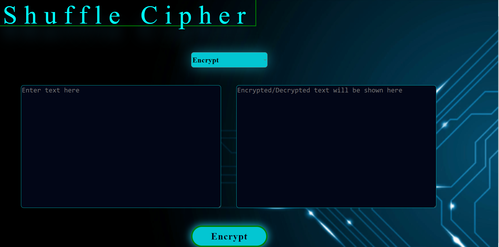

# Shuffle Cipher Web



<br>

### Purpose:

Shuffle Cipher is a web app which ciphers simple strings using a shuffle-cipher algorithm I cooked up for fun.<br/>
It allows users to prevent third parties from accessing information as plain text. Simple messages are converted to ciphered ASCII garbage text
<br>
Note: This is more of a cipher algorithm than an industry standard encryption algorithm and is susceptible to reverse engineering. This text encryption algorithm is more of a fun little side project than a guarantor of privacy.
Also, most algorithms are shown here in java, but this project is a web app, so the code in the file uploaded in vanilla js.
<br>

### Implementation Details:

What exactly does this program do, you might ask? Simple, really- it reads the ASCII values of each character in the string inputted by the user and just, well- plays around with the values. Think about it for a second- the ASCII value for the space character is 32, right? Now boost that value up by a random number between 8000 to 22000, say 9000- the said ASCII value now becomes 32+9000=9032 i.e '⍈'. 

Now, what if we took in a string and boosted each character in the string by 9000?

Sample String: "MAD SUS!"

Boosted String:"⍵⍩⍬⍈⍻⍽⍻⍉"

Boost Value/key: 9000

Now, simply subtracting 9000 from each character's ASCII value in the boosted string, we get the original string. Of course, such an encryption standard is trivially easy to break/reverse engineer, but it gets my point of playing around with ascii values to render text unreadable across. 

Encryption routine in it's simplest form:
```java
public static String encrypt(String s,int boost)
{

    String ss="";

    for(int k=0;k<s.length();++k)

    {

        char ch=s.charAt(k);

        ch+=boost;

        ss+=ch;

    }

    System.out.println(ss);

    return ss;

}
```
Of course, we can spice things up a bit- instead of adding up values to each character in the string, we can subtract a random value(say, between 20 and 40) from alternate characters in the string.

Now, we have a string with characters at odd positions boosted by say, 9000 and characters at even positions subtracted by say, 30.

Input String: "MAD SUS!"

Boost value: 9000

Decrement value: 30

Encrypted String:"/⍩&⍈5⍽5⍉"

To reverse the conversion, we simply need the boost value and decrement value, which will be used as keys- characters at even positions will be boosted by the decrement value and characters at odd positions will be decremented by the boost value.

Of course, to increase the complexity a bit, other conversions can be factored in, such as breaking the string into two parts at a random position and reversing one part(the first half), then adding both strings back together, increasing the complexity of reverse engineering the algorithm and simultaneously adding a third key to the algorithm.

Final Encryption Routine:
```java
public static String encrypt(String s,int boost,byte decrement,int pos)

{

    String ss="";

    for(int k=0;k<s.length();++k)

    {

        char ch=s.charAt(k);

        if(k%2!=0)

        ch+=boost;

        else

        ch-=decrement;

        ss+=ch;

    }

    //Split the string into 2 parts

    String a1=ss.substring(0,pos);

    String a2=ss.substring(pos);

    //reverse the first half

    a1=new StringBuffer(a1).reverse().toString();

    ss=a1+a2;

    System.out.println(ss);

    return ss;

}
```

Final Decryption Routine:
```java
public static String decrypt(String s,int boost,byte decrement,int pos)

{

    String ss="";

    String a1=s.substring(0,pos);

    String a2=s.substring(pos);

    //reverse the first half to bring it back to its original state

    a1=new StringBuffer(a1).reverse().toString();

    s=a1+a2;

    for(int k=0;k<s.length();++k)

    {

        char ch=s.charAt(k);

        if(k%2!=0)

        ch-=boost;

        else

        ch+=decrement;

        ss+=ch;

    }

    System.out.println(ss);

    return ss;

}

```
Input Text: "That's mad sus!"

Boost value:10000

Decrement value:40

position key: 3

encrypted text: 9❸,➄ ➃￸❽9❴￸➃M➃ 

decrypted text: That's mad sus!

Given below is the exact implementation of the cipher used in this web app.
(It's a web app, so the language used is ES6)
Encryption Routines:
```javascript
static encrypt(req) {
                let key = Math.floor((Math.random() * 10000) + 200);
                //	int key=r.nextInt(10000)+200;
                let bb = "";
                for (let a = 0; a < req.length; ++a) {
                    bb += String.fromCharCode(req.charCodeAt(a) + key);
                }
                bb += String.fromCharCode(key);
                return bb;
            }
            static shuffle(s) {

                let re = "";
                for (let k = 0; k < s.length; k++) {
                    let ch = s.charAt(k) + "";
                    if (k % 2 === 0) {
                        ch = String.fromCharCode(ch.charCodeAt(0) + 1);
                    } else {
                        ch = String.fromCharCode(ch.charCodeAt(0) - 1);
                    }
                    re += ch;
                }
                let pos = 0;
                while (pos === 0) {
                    pos = Math.floor(Math.random() * (re.length - 1));
                }
                let sp = re.substring(0, pos);
                let pp = re.substring(pos);


                let arr = sp.split('');
                arr.reverse();
                sp = arr.join('');

                re = sp + pp;
                return re + String.fromCharCode(pos);
            }
            
            static doEncryption(s) {
                s = Encrypter.performPadding(s);
                let re = Encrypter.shuffle(s);
                return Encrypter.encrypt(re);
            }
            
```
Decryption routines:
```javascript
           static decrypt(s) {
                let key = s.charCodeAt(s.length - 1);
                let bb = "";
                for (let a = 0; a < s.length - 1; ++a) {
                    bb += String.fromCharCode(s.charCodeAt(a) - key);
                }
                return bb;
            }
            
            static unshuffle(s) {
                let kindex = s.charCodeAt(s.length - 1);
                s = s.substring(0, s.length - 1);
                let sp = s.substring(0, kindex);
                let pp = s.substring(kindex);
                sp = sp.split('').reverse().join('');
                s = sp + pp;
                let re = "";
                for (let k = 0; k < s.length; ++k) {
                    let ch = s.charAt(k) + "";
                    if (k % 2 == 0) {
                        ch = String.fromCharCode(ch.charCodeAt(0) - 1);
                    } else {
                        ch = String.fromCharCode(ch.charCodeAt(0) + 1);
                    }
                    re += ch;
                }
                return re;
            }
            
            static doDecryption(s) {
                let re = Encrypter.decrypt(s);
                re = Encrypter.unshuffle(re);
                return re;
            }
```

As you can see, simple manipulations of ASCII values render the text unreadable to the human eye. As mentioned earlier, the algorithm can be brute forced/reverse engineered with encrypted text to decrypted text comparisons, and is not industry standard-it's still a great example of how simple manipulations of ASCII values can reflect on the original string!

### Using the Web-app:

[Test the web app on this site!](https://nikhil-rgb.github.io/apps/cipher/index.html)
