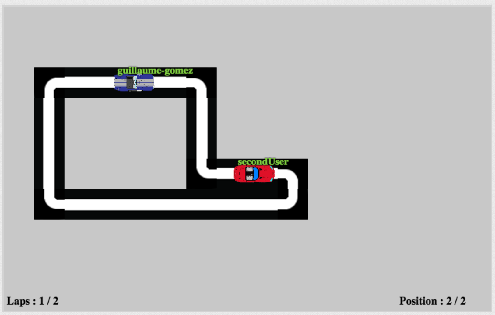

# MetaCall NodeJS Race Game Example
A Network video game to learn basic NodeJs Skills.

This application is an example of what it is possible to do with html5 and websockets.



## Dependancies :

- We are using **Nodejs** to run the server : https://github.com/nodejs/node
- The module **Express**, as web framework : https://github.com/expressjs/express
- The module **socket.io** (a higher abstraction of websockets) : https://github.com/socketio/socket.io

To install all those dependencies you need to have nodejs and npm installed.

Then run:
```
npm install
```
*this will install the module dependancies.*

- The library **jqueryrotate**, (a plugin to rotate Dom elements) : http://jqueryrotate.com/

- At last for the 2D game Framework we are using **JawsJs** : https://github.com/ippa/jaws

  *You don't need to do anything for these ones, they're included in the source code.*

### assets :

The cars were made by [bagera3005](http://bagera3005.deviantart.com/)

## Running the application :

In order to run the application:
```
node app.js
```
*You may need to run __nodejs__ instead of node depending on your configuration*

Now you have the server running, a text in the terminal should indicate on which **port** it is listening, if you have a conflic you can modify this in [config.json](config.json) 

Open a browser and go to 127.0.0.1:<**port**> (by default http://127.0.0.1:51510).

That's it ! now by default the server listens on all interfaces, so for example you can easily play on lan using your local ip address (for example 192.168.1.10)

## sublime-project
### packages

Here are the packages you may want to add to [sublime-text](https://www.sublimetext.com/) if you want to edit the files

- [HTML-CSS-JS Prettify](https://packagecontrol.io/packages/HTML-CSS-JS%20Prettify) **used to follow a clean coding style**


## Authors :
- [Gomez Guillaume](https://github.com/guillaume-gomez)
- [Jarretier Adrien](https://github.com/AdrienJarretier)
